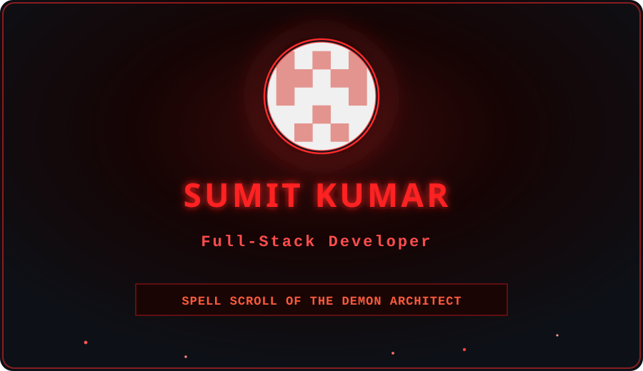
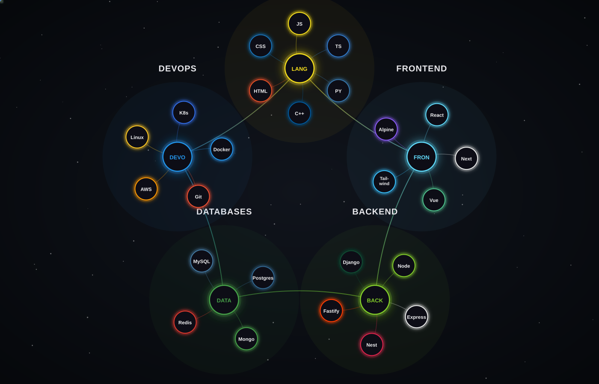

  <!-- TOP ANIMATED SVG HEADER BANNER -->
  

  

<!-- SECTION 1: ABOUT ME WITH LIGHT ANIMATED HEADER BANNER -->

  

 

<table align="center" width="95%" style="border-collapse: collapse;">
  <tr>
    <td bgcolor="#0d0000" style="border: 2px solid #ff1e1e; border-radius: 12px; padding: 24px; box-shadow: 0 0 20px rgba(255, 30, 30, 0.4);">
      

        
      

       
      
        Greetings, traveler of the digital abyssal realm. I am <b>Sumit Kumar</b>, a Full-Stack Engineer & Code Sorcerer crafting high-performance, resilient microservices and immersive dark-mode web experiences. I forge complex business requirements into elegant, lightning-fast software.
      
        
      <table width="100%" border="0">
        <tr>
          <td width="50%" valign="top">
            
              🐱‍👤 <b>Current Role:</b> Senior Full-Stack Engineer 
              🔥 <b>Main Domain:</b> Node.js, React, TypeScript, Cloud Native 
              📜 <b>Current Grimoire:</b> Rust, WebAssembly & High-Scale Systems 
            
          </td>
          <td width="50%" valign="top">
            
              ⚔️ <b>Cursed Fact:</b> Code compiles on the first try under a full moon. 
              🔮 <b>Summoning Circle:</b> Open for high-impact backend & full-stack roles. 
              ⚡ <b>Power Level:</b> Turning caffeine ☕ into 10x throughput. 
            
          </td>
        </tr>
      </table>
    </td>
  </tr>
</table>

  

<!-- SECTION 2: TECHNICAL SKILL CONSTELLATION MATRIX WITH ANIMATED BANNER -->

  
    

  <!-- ANIMATED SKILL CONSTELLATION GRAPH SVG -->
  

  

<!-- SECTION 3: GITHUB STATS WITH ANIMATED BANNER -->

  
    

  <!-- STATS & STREAK CARDS -->
  
  &nbsp;&nbsp;
  

    

  <!-- COMPACT TOP LANGUAGES BAR -->
  

    

  <!-- SNAKE CONTRIBUTION GRAPH -->
  

  

<!-- SECTION 4: EXPERIENCE WITH ANIMATED BANNER -->

  

 

<b>🔥 Senior Full-Stack Engineer | Tech Corp</b> <i>(2024 — Present)</i>

 
<ul>
  <li>🔥 Architected & deployed cloud-native microservices processing <b>10M+ daily events</b> with zero downtime using Node.js, Express, and AWS.</li>
  <li>🔥 Redesigned real-time web interface with React & TypeScript, boosting user engagement by <b>45%</b> and lowering latency by 120ms.</li>
  <li>🔥 Spearheaded CI/CD automation pipelines via GitHub Actions & Docker, reducing deployment cycle times from 40 mins to <b>under 5 mins</b>.</li>
</ul>

 

<b>🔥 Full-Stack Developer | Software Labs</b> <i>(2022 — 2024)</i>

 
<ul>
  <li>🔥 Built high-scale RESTful & GraphQL API gateway handling multi-tenant data synchronization across MongoDB and Redis caches.</li>
  <li>🔥 Developed modular UI component library in TailwindCSS & React, cutting design-to-production turnaround by <b>30%</b>.</li>
  <li>🔥 Optimized PostgreSQL database query execution plans, resulting in a <b>60% improvement</b> in query response times.</li>
</ul>

 

<b>🔥 Software Engineering Intern | Web Studio</b> <i>(2021 — 2022)</i>

 
<ul>
  <li>🔥 Engineered responsive web applications and integrated payment gateway systems using JavaScript & Node.js.</li>
  <li>🔥 Implemented unit & integration test suites achieving <b>92% code coverage</b>.</li>
</ul>

  

<!-- SECTION 5: PROJECTS WITH ANIMATED BANNER -->

  
    

  <table border="0" width="100%">
    <tr>
      <td width="50%" align="center" valign="top">
        ⚔️ <i>Forged with React, Node.js & Socket.io</i> 
        
      </td>
      <td width="50%" align="center" valign="top">
        ⚔️ <i>Forged with TypeScript & Microservices</i> 
        
      </td>
    </tr>
  </table>

  

<!-- SECTION 6: FOOTER WITH ANIMATED BANNER -->

  <!-- FOOTER CAPSULE RENDER WAVE -->
  

    

  <!-- SOCIAL BADGES ROW -->
  
  &nbsp;&nbsp;
  
  &nbsp;&nbsp;
  
  &nbsp;&nbsp;
  

    

  <!-- VISITOR COUNTER BADGE -->
  

    

  
    <i>Forged in blood & code by <b>Sumit Kumar</b> • Dark Hellfire Realm 😈🔥</i>
  

